# Code Guardian - Complete Sequence Diagram (v1.0.7)

This diagram shows all major flows including RAG, caching, vulnerability data, and workspace dashboard.

```mermaid
sequenceDiagram
    participant User
    participant VSCode
    participant Extension as Code Guardian Extension
    participant Cache as Analysis Cache (LRU)
    participant RAG as RAG Manager
    participant VulnData as Vulnerability Data Manager
    participant Scanner as Workspace Scanner
    participant Dashboard as Dashboard Generator
    participant LLM as Ollama LLM Server
    participant APIs as External APIs (NVD, OWASP, GitHub)
    participant Webview

    %% ========================================
    %% INITIALIZATION
    %% ========================================
    Note over Extension: Extension Activation
    Extension->>Cache: Initialize LRU Cache
    Extension->>RAG: Lazy initialize RAG Manager (if enabled)
    RAG->>LLM: Load embeddings model
    Extension->>VulnData: Check vulnerability data cache (24h TTL)
    alt Cache expired
        VulnData->>APIs: Fetch NVD CVEs (100 latest)
        VulnData->>APIs: Fetch OWASP Top 10
        VulnData->>APIs: Fetch CWE patterns (20)
        VulnData->>APIs: Fetch GitHub advisories
        APIs-->>VulnData: Return security data
        VulnData->>VulnData: Cache data (24h expiration)
    end

    %% ========================================
    %% REAL-TIME FUNCTION ANALYSIS
    %% ========================================
    Note over User,Webview: Flow 1: Real-time Function Analysis
    User->>VSCode: Edits code / moves cursor
    VSCode->>Extension: Trigger analysis (800ms debounced)
    Extension->>Extension: Extract function under cursor

    Extension->>Cache: Check cache (crypto hash key)
    alt Cache hit (95-98% of cases)
        Cache-->>Extension: Return cached analysis
        Extension->>VSCode: Show diagnostics & quick fixes 💡
    else Cache miss
        alt RAG enabled
            Extension->>RAG: Search relevant security knowledge
            RAG->>RAG: Vector similarity search (HNSWlib)
            RAG-->>Extension: Return relevant knowledge snippets
            Extension->>Extension: Enhance prompt with RAG context
        end

        Extension->>VulnData: Get current vulnerability patterns
        VulnData-->>Extension: Return CWE, OWASP, CVE data
        Extension->>Extension: Enhance prompt with vuln data

        Extension->>LLM: Send enhanced prompt
        alt LLM call fails
            Extension->>Extension: Retry with exponential backoff (3 attempts)
            Extension->>LLM: Retry analysis
        end
        LLM-->>Extension: Return analysis (JSON)

        Extension->>Cache: Store result (crypto hash key)
        Extension->>VSCode: Show diagnostics & quick fixes 💡
    end

    %% ========================================
    %% FULL FILE ANALYSIS
    %% ========================================
    Note over User,Webview: Flow 2: Full File Analysis
    User->>VSCode: Run "Analyze Full File" command
    VSCode->>Extension: Trigger file analysis
    Extension->>Cache: Check cache for file
    alt Cache miss
        Extension->>RAG: Get security knowledge (if enabled)
        Extension->>VulnData: Get vulnerability patterns
        Extension->>LLM: Analyze full file (with retry logic)
        LLM-->>Extension: Return issues (JSON)
        Extension->>Cache: Cache results
    end
    Extension->>VSCode: Report all diagnostics & quick fixes 💡

    %% ========================================
    %% AI COPILOT (SELECTION ANALYSIS)
    %% ========================================
    Note over User,Webview: Flow 3: AI Copilot - Selection Analysis
    User->>VSCode: Run "Analyze Selected Code with AI"
    VSCode->>Extension: Trigger selection analysis
    Extension->>Webview: Open analysis webview
    Extension->>RAG: Search relevant knowledge (if enabled)
    Extension->>VulnData: Get security patterns
    Extension->>LLM: Stream analysis (with context)
    LLM-->>Extension: Stream response (Markdown)
    Extension->>Webview: Update with streamed content
    Webview->>User: Show analysis + enable follow-up

    %% ========================================
    %% CONTEXTUAL Q&A
    %% ========================================
    Note over User,Webview: Flow 4: Contextual Q&A
    User->>VSCode: Run "Contextual Q&A" command
    VSCode->>Extension: Open Q&A interface
    Extension->>Webview: Render Q&A webview
    User->>Webview: Select files/folders + ask question
    Webview->>Extension: Send context + question
    Extension->>RAG: Search knowledge base (if enabled)
    Extension->>VulnData: Get relevant vuln data
    Extension->>LLM: Send enhanced question
    LLM-->>Extension: Return answer (Markdown)
    Extension->>Webview: Display answer
    Webview->>User: Show answer + enable follow-up

    %% ========================================
    %% WORKSPACE SECURITY DASHBOARD
    %% ========================================
    Note over User,Dashboard: Flow 5: Workspace Security Dashboard (NEW v1.0.6)
    User->>VSCode: Run "Workspace Security Dashboard"
    VSCode->>Extension: Trigger workspace scan
    Extension->>Scanner: Initialize workspace scanner
    Extension->>Webview: Show progress webview

    Scanner->>Scanner: Discover all JS/TS files
    loop For each file
        Scanner->>Extension: Progress callback (file N of M)
        Extension->>Webview: Update progress bar
        Extension->>Cache: Check file cache
        alt Cache miss
            Extension->>RAG: Get security knowledge
            Extension->>VulnData: Get vulnerability data
            Extension->>LLM: Analyze file (with retry)
            LLM-->>Extension: Return issues
            Extension->>Cache: Cache results
        end
        Extension->>Scanner: Return file analysis
    end

    Scanner-->>Extension: Complete scan results
    Extension->>Dashboard: Generate dashboard HTML
    Dashboard->>Dashboard: Calculate security score (0-100)
    Dashboard->>Dashboard: Assign letter grade (A-F)
    Dashboard->>Dashboard: Generate vulnerability heatmap
    Dashboard->>Dashboard: Identify top 20 vulnerable files
    Dashboard-->>Extension: Return dashboard HTML
    Extension->>Webview: Render security dashboard
    Webview->>User: Show interactive dashboard

    %% ========================================
    %% VULNERABILITY DATA UPDATE
    %% ========================================
    Note over User,APIs: Flow 6: Manual Vulnerability Data Update
    User->>VSCode: Run "Update Vulnerability Data"
    VSCode->>Extension: Trigger data update
    Extension->>VulnData: Force refresh all sources
    VulnData->>APIs: Fetch latest NVD CVEs
    VulnData->>APIs: Fetch OWASP Top 10
    VulnData->>APIs: Fetch CWE patterns
    VulnData->>APIs: Fetch GitHub advisories
    APIs-->>VulnData: Return fresh data (165+ entries)
    VulnData->>VulnData: Update cache (24h TTL)
    VulnData-->>Extension: Update complete
    Extension->>User: Show success notification

    %% ========================================
    %% RAG KNOWLEDGE MANAGEMENT
    %% ========================================
    Note over User,RAG: Flow 7: RAG Knowledge Base Management
    User->>VSCode: Run "Manage RAG Knowledge Base"
    VSCode->>Extension: Open RAG manager
    Extension->>Webview: Show knowledge editor
    User->>Webview: Add custom security pattern
    Webview->>Extension: Save new knowledge
    Extension->>RAG: Add to vector store
    RAG->>LLM: Generate embedding
    LLM-->>RAG: Return vector
    RAG->>RAG: Store in HNSWlib index
    RAG-->>Extension: Knowledge added
    Extension->>User: Show success notification

    %% ========================================
    %% CACHE STATISTICS
    %% ========================================
    Note over User,Cache: Flow 8: View Cache Statistics
    User->>VSCode: Run "View Cache Statistics"
    VSCode->>Extension: Request cache stats
    Extension->>Cache: Get statistics
    Cache-->>Extension: Return hits, misses, size, hit rate
    Extension->>User: Display stats (95-98% hit rate)

    %% ========================================
    %% QUICK FIX APPLICATION
    %% ========================================
    Note over User,VSCode: Flow 9: Apply Quick Fix
    User->>VSCode: Click quick fix lightbulb 💡
    VSCode->>Extension: Apply selected fix
    Extension->>VSCode: Edit document with secure code
    VSCode->>User: Show updated code
```

## Key Components

### 🔐 Analysis Cache (LRU)
- Crypto-based hash keys for code uniqueness
- 95-98% hit rate on repeated analysis
- Automatic eviction of least recently used entries
- Significant performance improvement

### 🧠 RAG Manager
- Vector store using HNSWlib for similarity search
- Ollama embeddings for semantic understanding
- Enhances prompts with relevant security knowledge
- Optional - can be toggled on/off

### 📊 Vulnerability Data Manager
- **NVD API**: 100 latest CVEs
- **OWASP**: Complete Top 10 (2021)
- **CWE Database**: 20 common weakness patterns
- **GitHub Security Advisories**: npm vulnerabilities
- **Total**: 165+ vulnerability entries
- **Cache**: 24-hour TTL with automatic refresh

### 🔍 Workspace Scanner
- Discovers all JavaScript/TypeScript files
- Concurrent file analysis with progress tracking
- Integrates with cache for performance
- Generates comprehensive security reports

### 📈 Dashboard Generator
- Security scoring algorithm (weighted by severity)
- Letter grades: A (90-100) to F (0-59)
- Interactive vulnerability heatmap (Chart.js)
- Top 20 most vulnerable files listing
- Normalized by codebase size

### ⚡ Performance Features
- **Debouncing**: 800ms delay for real-time analysis
- **Retry Logic**: Exponential backoff (3 attempts)
- **Lazy Loading**: RAG initialized on first use
- **Smart Caching**: Reduces LLM calls by 95-98%

## Analysis Flow Summary

1. **User Action** → Triggers analysis
2. **Cache Check** → 95-98% hit rate (instant return)
3. **RAG Enhancement** → Add relevant knowledge (if enabled)
4. **Vulnerability Data** → Add latest CVE/OWASP/CWE patterns
5. **LLM Analysis** → Process with enhanced prompt
6. **Retry Logic** → Handle transient failures (3 attempts)
7. **Cache Store** → Save for future use
8. **Display Results** → Show diagnostics, fixes, or dashboard

## Performance Metrics

- **Cache Hit Rate**: 95-98% (measured)
- **Analysis Time**: <100ms (cached), 2-5s (uncached)
- **Debounce Delay**: 800ms for real-time
- **Retry Attempts**: 3 with exponential backoff
- **Data Refresh**: 24 hours for vulnerability data
