# Code Guardian - System Architecture (v1.0.7)

Complete system architecture showing all components, data flows, and integrations.

```mermaid
graph TB
    %% ========================================
    %% USER INTERFACE LAYER
    %% ========================================
    subgraph "User Interface Layer"
        User[👤 Developer]
        VSCode[VS Code Editor]
        StatusBar[Status Bar<br/>🧠 RAG Status]
        QuickFix[Quick Fix 💡<br/>Code Actions]
    end

    %% ========================================
    %% EXTENSION CORE
    %% ========================================
    subgraph "Extension Core Layer"
        ExtEntry[Extension Entry Point<br/>extension.ts]
        FuncExtract[Function Extractor<br/>Code Parser]
        Diagnostic[Diagnostic Manager<br/>VS Code Integration]
        Actions[Quick Fix Provider<br/>Code Actions]
        ModelMgr[Model Manager<br/>20+ Ollama Models]
    end

    %% ========================================
    %% INTELLIGENCE LAYER
    %% ========================================
    subgraph "Intelligence & Analysis Layer"
        Analyzer[Security Analyzer<br/>analyzer.ts]

        subgraph "Performance Layer"
            Cache[Analysis Cache LRU<br/>Crypto Hash Keys<br/>95-98% Hit Rate]
        end

        subgraph "Knowledge Enhancement"
            RAG[RAG Manager<br/>Vector Store HNSWlib<br/>Semantic Search]
            VulnData[Vulnerability Data Manager<br/>165+ Entries<br/>24h Cache TTL]
        end

        subgraph "Workspace Analysis"
            Scanner[Workspace Scanner<br/>Concurrent Analysis<br/>Progress Tracking]
            DashGen[Dashboard Generator<br/>Security Scoring<br/>Heatmap Visualization]
        end
    end

    %% ========================================
    %% DATA SOURCES LAYER
    %% ========================================
    subgraph "External Data Sources"
        NVD[(NVD API<br/>100 Latest CVEs)]
        OWASP[(OWASP Top 10<br/>Complete 2021)]
        CWE[(CWE Database<br/>20 Patterns)]
        GitHub[(GitHub Security<br/>Advisories)]
    end

    %% ========================================
    %% AI/LLM LAYER
    %% ========================================
    subgraph "AI Processing Layer"
        Ollama[Ollama LLM Server<br/>Local Execution]

        subgraph "Available Models"
            Models[qwen2.5-coder<br/>deepseek-coder<br/>llama3.1<br/>codellama<br/>phi3<br/>gemma2<br/>+ 15 more models]
        end

        Embeddings[Ollama Embeddings<br/>nomic-embed-text<br/>Vector Generation]
    end

    %% ========================================
    %% PRESENTATION LAYER
    %% ========================================
    subgraph "Webview Presentation Layer"
        AnalysisView[Analysis Webview<br/>AI Copilot UI<br/>Streaming Markdown]
        QnAView[Contextual Q&A Webview<br/>File/Folder Context<br/>Follow-up Questions]
        DashView[Security Dashboard<br/>Score: 0-100 A-F<br/>Interactive Heatmap<br/>Top 20 Vulnerable Files]
        RAGView[RAG Management UI<br/>Knowledge Base Editor<br/>Custom Patterns]
    end

    %% ========================================
    %% DATA FLOWS
    %% ========================================

    %% User interactions
    User -->|Types Code| VSCode
    User -->|Commands| VSCode
    VSCode -->|Real-time Events| ExtEntry
    VSCode -->|Commands| ExtEntry

    %% Extension core flows
    ExtEntry -->|Extract Code| FuncExtract
    ExtEntry -->|Check Cache| Cache
    ExtEntry -->|Analyze| Analyzer
    ExtEntry -->|Scan Workspace| Scanner

    FuncExtract -->|Code Segments| Analyzer

    %% Analysis flow with cache
    Cache -->|Cache Hit<br/>95-98%| ExtEntry
    Cache -.->|Cache Miss<br/>2-5%| Analyzer

    %% RAG enhancement
    Analyzer -->|Search Knowledge| RAG
    RAG -->|Generate Embeddings| Embeddings
    Embeddings -->|Vectors| RAG
    RAG -->|Relevant Context| Analyzer

    %% Vulnerability data enhancement
    Analyzer -->|Get Vuln Data| VulnData
    VulnData -->|Fetch CVEs| NVD
    VulnData -->|Fetch OWASP| OWASP
    VulnData -->|Fetch CWE| CWE
    VulnData -->|Fetch Advisories| GitHub
    VulnData -->|Security Patterns| Analyzer

    %% LLM processing
    Analyzer -->|Enhanced Prompt| Ollama
    Ollama -->|Select Model| Models
    Models -->|Process| Ollama
    Ollama -->|Analysis Results| Analyzer
    Analyzer -->|Store Result| Cache

    %% Results presentation
    Analyzer -->|Issues Found| Diagnostic
    Diagnostic -->|Diagnostics| VSCode
    Diagnostic -->|Suggest Fixes| Actions
    Actions -->|Quick Fixes| QuickFix
    QuickFix -->|Apply Fix| VSCode

    %% Webview flows
    ExtEntry -->|Stream Analysis| AnalysisView
    ExtEntry -->|Q&A Interface| QnAView
    ExtEntry -->|Manage Knowledge| RAGView
    AnalysisView -->|Display| User
    QnAView -->|Display| User
    RAGView -->|Edit| User

    %% Workspace dashboard flow
    Scanner -->|Scan Files| Cache
    Scanner -->|Analyze Each| Analyzer
    Scanner -->|Results| DashGen
    DashGen -->|Calculate Score| DashGen
    DashGen -->|Generate HTML| DashView
    DashView -->|Display| User

    %% Status bar
    ExtEntry -->|Update Status| StatusBar
    StatusBar -->|Toggle RAG| ExtEntry

    %% Model management
    ExtEntry -->|Select Model| ModelMgr
    ModelMgr -->|Configure| Ollama

    %% ========================================
    %% STYLING
    %% ========================================
    classDef userLayer fill:#e1f5ff,stroke:#01579b,stroke-width:2px
    classDef coreLayer fill:#fff3e0,stroke:#e65100,stroke-width:2px
    classDef intelligenceLayer fill:#f3e5f5,stroke:#4a148c,stroke-width:2px
    classDef dataLayer fill:#e8f5e9,stroke:#1b5e20,stroke-width:2px
    classDef aiLayer fill:#fff9c4,stroke:#f57f17,stroke-width:2px
    classDef webviewLayer fill:#fce4ec,stroke:#880e4f,stroke-width:2px

    class User,VSCode,StatusBar,QuickFix userLayer
    class ExtEntry,FuncExtract,Diagnostic,Actions,ModelMgr coreLayer
    class Analyzer,Cache,RAG,VulnData,Scanner,DashGen intelligenceLayer
    class NVD,OWASP,CWE,GitHub dataLayer
    class Ollama,Models,Embeddings aiLayer
    class AnalysisView,QnAView,DashView,RAGView webviewLayer
```



## Architecture Layers

### 1️⃣ User Interface Layer
**Components:**
- VS Code Editor integration
- Status bar with RAG toggle
- Quick fix lightbulb (💡) for code actions
- Command palette integration

**Responsibilities:**
- Capture user interactions
- Display real-time diagnostics
- Provide quick fix suggestions
- Show extension status

### 2️⃣ Extension Core Layer
**Components:**
- `extension.ts` - Entry point and command registration
- `functionExtractor.ts` - Code parsing and AST analysis
- `diagnostic.ts` - VS Code diagnostics management
- `actions.ts` - Quick fix code actions provider
- `modelManager.ts` - AI model selection and configuration

**Responsibilities:**
- Extension lifecycle management
- Command registration (10+ commands)
- Event handling (debounced real-time analysis)
- VS Code API integration

### 3️⃣ Intelligence & Analysis Layer
**Components:**

**Analysis Core:**
- `analyzer.ts` - Main security analysis engine with retry logic

**Performance Optimization:**
- `analysisCache.ts` - LRU cache with crypto-based hashing
  - 95-98% hit rate
  - Automatic eviction
  - Statistics tracking

**Knowledge Enhancement:**
- `ragManager.ts` - Vector store with semantic search
  - HNSWlib for similarity search
  - Ollama embeddings integration
  - Custom knowledge base support

- `vulnerabilityDataManager.ts` - Real-time security data
  - 165+ vulnerability entries
  - Multi-source integration (NVD, OWASP, CWE, GitHub)
  - 24-hour cache with automatic refresh

**Workspace Analysis:**
- `workspaceScanner.ts` - Concurrent file scanner
  - Progress tracking callbacks
  - File pattern filtering
  - Batch processing

- `dashboardWebview.ts` - Dashboard generator
  - Security scoring algorithm (0-100)
  - Letter grades (A-F)
  - Vulnerability heatmap
  - Top 20 vulnerable files

**Responsibilities:**
- Security vulnerability detection
- Performance optimization through caching
- Knowledge-enhanced analysis
- Workspace-wide scanning
- Interactive reporting

### 4️⃣ External Data Sources Layer
**APIs:**
- **NVD (National Vulnerability Database)**: 100 latest CVEs
- **OWASP Top 10 (2021)**: Complete list of web vulnerabilities
- **CWE (Common Weakness Enumeration)**: 20 common patterns
- **GitHub Security Advisories**: npm package vulnerabilities

**Data Management:**
- 24-hour cache TTL
- Automatic background refresh
- Manual update command
- Retry logic with rate limit handling

### 5️⃣ AI Processing Layer
**Components:**
- **Ollama LLM Server**: Local AI execution (100% private)
- **20+ Models Available**:
  - Code-specialized: qwen2.5-coder, deepseek-coder, codellama
  - General: llama3.1, phi3, gemma2, mistral
  - Lightweight: tinyllama, phi, qwen
- **Embeddings**: nomic-embed-text for vector generation

**Responsibilities:**
- Code analysis with AI models
- Vector embedding generation for RAG
- Streaming responses for real-time UI
- Local execution (no data leaves machine)

### 6️⃣ Webview Presentation Layer
**Components:**
- **Analysis Webview**: AI Copilot with streaming markdown
- **Contextual Q&A Webview**: File/folder context + follow-up
- **Security Dashboard**: Interactive visualizations (Chart.js)
- **RAG Management UI**: Custom knowledge base editor

**Technologies:**
- HTML5 + CSS3 + JavaScript
- Chart.js for visualizations
- Marked.js for markdown rendering
- VS Code Webview API

## Data Flow Patterns

### 🔄 Real-time Analysis Flow
```
User Types → Debounce (800ms) → Extract Function →
Check Cache → [Hit: Return | Miss: RAG + Vuln Data + LLM] →
Store Cache → Display Diagnostics + Quick Fixes
```

### 🔄 Workspace Dashboard Flow
```
Command Trigger → Discover Files → For Each File:
  [Check Cache → Analyze with LLM → Store Cache] →
Aggregate Results → Calculate Score → Generate Heatmap →
Display Dashboard
```

### 🔄 RAG Enhancement Flow
```
Code to Analyze → Search Vector Store →
Find Similar Patterns → Extract Relevant Knowledge →
Enhance Prompt → Send to LLM
```

### 🔄 Vulnerability Data Flow
```
24h Timer | Manual Command → Check Cache Expiry →
Fetch NVD + OWASP + CWE + GitHub →
Combine Data (165+ entries) → Cache for 24h →
Use in Analysis
```

## Performance Characteristics

### ⚡ Cache Performance
- **Hit Rate**: 95-98% (measured)
- **Cache Miss Penalty**: 2-5 seconds (LLM call)
- **Cache Hit Speed**: <100ms (instant)
- **Storage**: In-memory LRU with configurable size

### ⚡ Analysis Performance
- **Real-time Debounce**: 800ms
- **Retry Logic**: 3 attempts with exponential backoff
- **Concurrent Scans**: Multiple files analyzed in parallel
- **Lazy Loading**: RAG initialized on first use

### ⚡ Data Refresh
- **Vulnerability Data**: 24-hour TTL
- **RAG Vectors**: Persistent across sessions
- **Cache Eviction**: LRU algorithm (least recently used)

## Security & Privacy

### 🔒 100% Local Processing
- All AI analysis happens on user's machine via Ollama
- No code sent to external servers
- No telemetry or tracking
- Full offline capability (after initial setup)

### 🔒 Data Security
- Vulnerability data cached locally
- Knowledge base stored in extension storage
- No sensitive code logged or transmitted

## Integration Points

### 📌 VS Code Integration
- **Diagnostics API**: Real-time issue reporting
- **Code Actions API**: Quick fix suggestions
- **Webview API**: Custom UI panels
- **Commands API**: 10+ registered commands
- **Status Bar API**: Extension status display
- **Configuration API**: User settings management

### 📌 Ollama Integration
- **REST API**: HTTP requests to localhost:11434
- **Model Management**: Dynamic model selection
- **Streaming**: Real-time response streaming
- **Embeddings**: Vector generation for RAG

### 📌 External APIs
- **NVD API**: REST API with rate limiting
- **GitHub API**: GraphQL for security advisories
- **OWASP/CWE**: Curated datasets (bundled)

## Technology Stack

### Languages & Frameworks
- **TypeScript**: Main extension code
- **JavaScript**: Webview UI logic
- **HTML/CSS**: Webview presentation
- **Node.js**: Runtime environment

### Libraries & Dependencies
- **@langchain/community**: RAG framework
- **hnswlib-node**: Vector similarity search
- **Chart.js**: Dashboard visualizations
- **Marked.js**: Markdown rendering
- **crypto**: Hash generation for cache keys

### Development Tools
- **ESBuild**: Fast bundling
- **ESLint**: Code linting
- **Mocha**: Unit testing
- **c8**: Code coverage
- **VS Code Test**: Integration testing

## Scalability Considerations

### 🚀 Performance Optimizations
- LRU cache prevents repeated LLM calls (95-98% reduction)
- Debouncing reduces analysis frequency during typing
- Lazy loading defers expensive initialization
- Concurrent scanning for workspace analysis

### 🚀 Resource Management
- Memory-efficient LRU cache with eviction
- Configurable cache size limits
- Background data refresh (non-blocking)
- Progress tracking for long operations

### 🚀 Error Handling
- Retry logic with exponential backoff
- Graceful degradation when components fail
- User-friendly error messages
- Detailed logging for debugging

## Future Architecture Enhancements

### 🔮 Planned Features (from TODO list)
1. **Custom Knowledge Base Editor**: GUI for managing RAG knowledge
2. **Trend Analysis**: Track vulnerability trends over time
3. **Multi-language Support**: Extend beyond JS/TS
4. **CI/CD Integration**: Pre-commit hooks and pipeline integration
5. **Team Knowledge Sharing**: Shared RAG knowledge bases

### 🔮 Potential Improvements
- Incremental analysis (only changed code)
- Distributed caching for teams
- Advanced visualization (dependency graphs)
- Machine learning for pattern detection
- Integration with SAST tools
